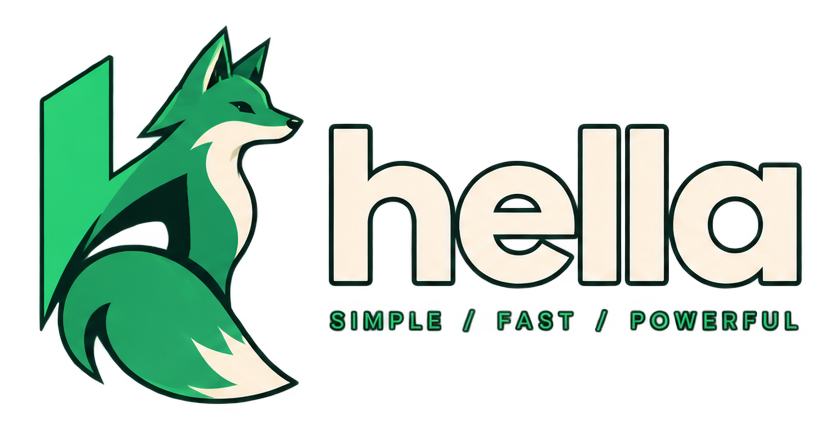

<div align="center" style="height: 230px;">
    
</div>

Hella is a small, statically-typed programming language with a compiler written in Rust that produces native binaries via LLVM.

```hll
import std::io

void main() do
    println("Hello, Hella!")
end
```

No curly braces, no `let`; blocks are `do … end` and declarations are type-first (`int x = 1`).

## Quick start

**Prerequisites:** Rust (edition 2024), LLVM 21 (`llvm-config --version` should print `21.x`), and `clang` for linking (Xcode Command Line Tools on macOS).

```sh
cargo build                         # build the compiler
cargo run -p hella -- setup         # install the standard library to ~/.hella/lib

# Start your own project, or try an example:
cargo run -p hella -- new hello     # scaffold hello/ with src/main.hll
cargo run -p hella -- run examples/hello_io.hll
```

## Commands

| Command | What it does |
|---------|--------------|
| `hella build <file>` | Compile a `.hll` file to a native binary (same name, extension stripped) |
| `hella run <file>` | Build (only if sources changed) and run it |
| `hella check <file>` | Type-check without generating code |
| `hella new <name>` | Scaffold a project (`--lib` for a library instead of a binary) |
| `hella setup` | Install the embedded standard library to `~/.hella/lib` (`--force` to overwrite) |
| `hella lsp` | Run the language server (LSP over stdio) |

Short aliases work too: `b`, `r`, `c`, `ls`. Add `--verbose` for per-phase output or `--quiet` for errors only. Any command accepts `--help` (e.g. `hella build --help`).

## Hella at a glance

```hll
struct User has
    string name
    int age = 30          // fields can have defaults
end

int fib(int n) do         // type-first declarations, no `let`
    if n < 2 do
        return n
    end
    return fib(n - 1) + fib(n - 2)
end

void main() do
    User u = has name = "Ada" end   // `User` is inferred from the declaration
    match u.age do
        30 -> println("default age")
        _  -> println("custom age")
    end
end
```

A few things that make Hella Hella:

- **Blocks are `do … end`**, and struct/class/trait/enum bodies are `has … end`.
- **Statements end with a newline or `;`.**
- **`match … do` with `->` arms**, `_` wildcards, `|`/`or` alternatives, and tuple patterns.
- **Classes** with `this`, `initialize` constructors, `open`/`override`/`sealed`, traits + `implements`, and `get`/`set` properties.
- **Generics with `where` bounds**, `distinct`/`typedef` types, `extend` blocks, closures, string interpolation (`"hi {name}"`), and `extern "c"` for calling C.
- **`defer`** runs when its scope exits, on every path.

## Examples

The `examples/` directory is the fastest way to learn. Build one and run the binary:

```sh
cargo run -p hella -- build examples/basics.hll && ./examples/basics; echo $?
```

| File | Shows you |
|------|-----------|
| `basics.hll` | Numbers, booleans, arithmetic, `if`/`else`, `while`, functions, recursion |
| `data_control.hll` | Structs, field defaults, arrays, `match`, strings, `loop`/`for`, `defer` |
| `abstraction.hll` | Classes, constructors, traits, enums, properties |
| `hello_io.hll` | `import std::io` and printing (`print`, `println`, `printInt`, `putChar`) |
| `advanced.hll` | Generics, closures, interpolation, operators, `extern`, `distinct` |
| `variadic.hll` | Variadic functions (`...`) |

The exit code of each example is its answer; `basics` exits with `230`, `abstraction` with `233`, and so on.

## Project layout

```
hella/
├── crates/
│   ├── hella-cli/       # the `hella` binary (commands, progress output)
│   ├── hella-compiler/  # the compiler library (lexer → parser → sema → codegen)
│   └── hella-lsp/       # the language server
├── examples/            # .hll example programs
├── stdlib/              # standard library, written in Hella itself
└── references/          # language spec and design notes
```

The pipeline is: lex → parse → resolve imports → type-check → LLVM IR → object file → `clang` links a native binary. Run `cargo test` to execute the test suite.

## Learn more

The grammar in `references/ebnf-0.1.txt` is authoritative. Also see `references/phases.md` (how the language was built, phase by phase) and `references/llvm-mapping.md` (how Hella types lower to LLVM). `SKILL.md` has detailed guidance for working on the compiler itself.

## Status

The core language (phases 0-5) compiles to native code: structs, classes, traits, enums, pattern matching, generics, closures, string interpolation, and C interop all work end to end. The gap list in `SKILL.md` tracks what remains.

## License

Apache-2.0 ... see [`LICENSE`](/LICENSE).
